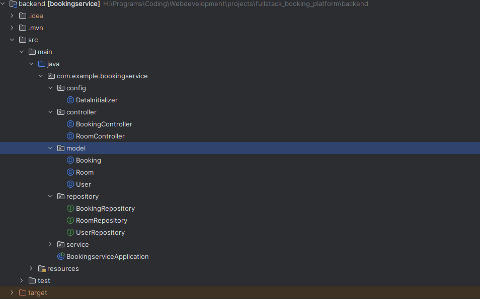
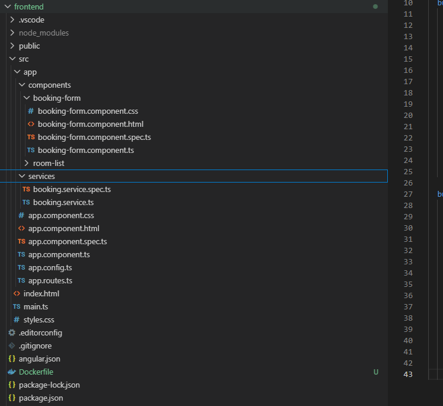
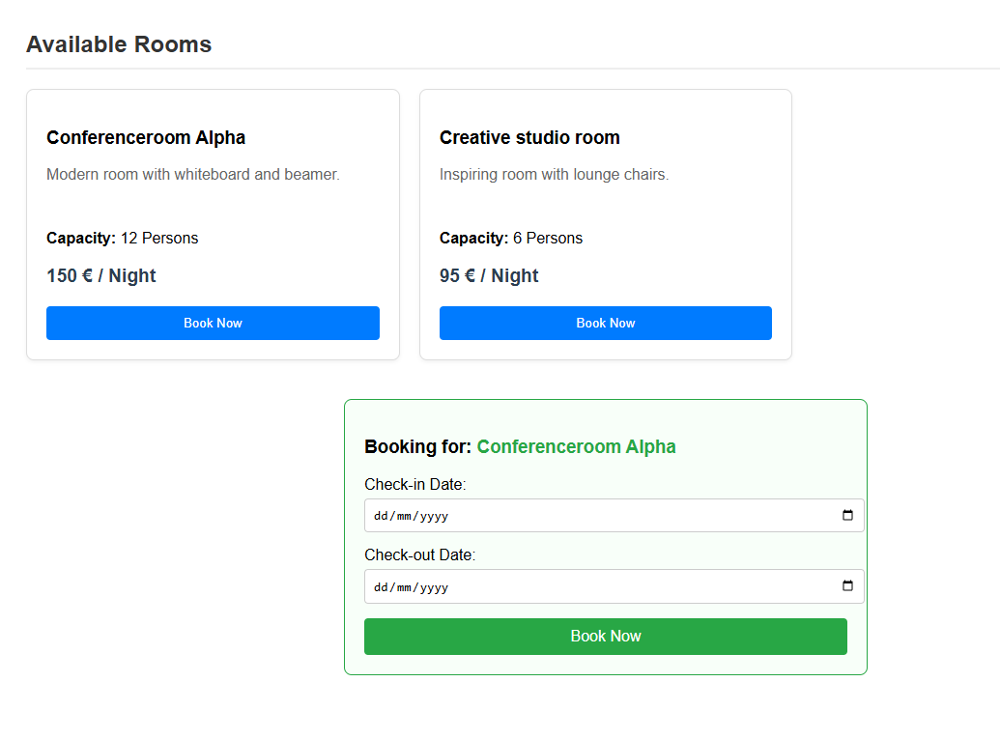

# Roomify Lite - Enterprise Booking & Reservation Platform

This project is a high-performance, containerized full-stack enterprise booking system built with Angular (v17+), Java Spring Boot, and PostgreSQL. It demonstrates complex date-logic validation, data consistency under heavy load via database locking mechanisms, and a production-ready DevOps infrastructure.

The application serves as a modern consumer-facing reservation hub where users can view and book premium spaces or services. Instead of basic CRUD operations, this project focuses heavily on backend data integrity, ensuring that no space can be double-booked even during concurrent millisecond-level requests.

---

## Project Goals
- **Data Integrity & Concurrency:** Implement robust database locking (Optimistic Locking via Hibernate @Version) to handle race conditions gracefully.
- **Advanced Business Logic:** Build a type-safe Spring Boot backend capable of processing overlapping date ranges and automated transaction rollbacks.
- **DevOps & Containerization:** Dockerize the entire microservice architecture (Frontend, Backend, DB) for seamless "one-command" local deployment.
- **Modern Modular Frontend:** Leverage Angular's Standalone Component architecture to build a highly maintainable, component-driven UI.
- **Automated Quality Gate:** Establish a Continuous Integration (CI) pipeline via GitHub Actions to validate all builds automatically.

---

## Features
- **Interactive Space Discovery:** A clean, grid-based consumer marketplace displaying available rooms, capacity badges, and pricing metrics fetched directly from the API.
- **Race-Condition Protection:** Built-in protection against double-booking. If two users click "Book" at the exact same millisecond, the system safely rejects the second request with a clean 409 Conflict status, preventing data corruption.
- **Strict Date-Logic Validation:** An automated backend validation engine that rejects past booking dates, mismatched check-out timelines, or overlapping reservation windows.
- **Automated Database Seeding:** The backend automatically detects an empty PostgreSQL instance on startup and seeds realistic, production-ready room assets and dummy user entities.
- **Production-Ready Multi-Stage Builds:** High-efficiency Docker deployment using Multi-Stage Maven builds for a lightweight JRE runtime, and an Nginx container serving the compiled Angular frontend.

---

## Tech Stack

### Frontend
- **Angular 19+** (Standalone Components, Modular Architecture, Asynchronous RxJS API consumption)
- **TypeScript**
- **Native HTML5 Date Pickers** (With dynamic dynamic error binding)

### Backend
- **Spring Boot 3+** (Spring Web, Spring Data JPA, Lombok)
- **Spring Data JPA** (Optimistic Concurrency Control / @Version tracking)
- **Transactional Safety** (@Transactional management for safe database rollbacks)

### Database & Infrastructure
- **PostgreSQL 16** (Persistent Relational Database running in an isolated Docker container)
- **Docker & Docker Compose** (Container Orchestration)
- **Nginx** (Production Web Server hosting the static frontend assets)

### DevOps / CI-CD
- **GitHub Actions** (Automated Multi-Job Workflow for Build Verification)

---

## Quick Start (Local Deployment)

Thanks to full Docker integration, you can spin up the entire local infrastructure (Database, Spring Boot Backend, Nginx Frontend) with a single command.

### Installation
1. Start the entire applicaton framework:
    docker compose up--build
2. Open your browser and navigate to:
    http://localhost
---

## Screenshots

